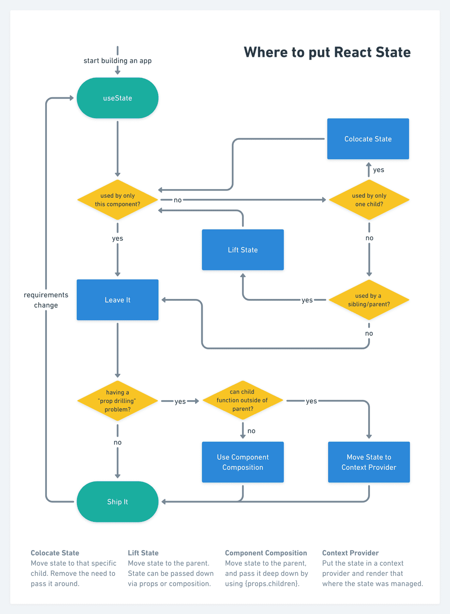

# Reactathon - Application state management by Kent C Dodds - Summary

<!-- ------------------------ -->

## React is a state management library

State management is challenging, but it doesn't need to be

- Important to differentiate between UI state and Server state
  - UI state - isLoading, controlled components, etc
  - Server state - Data fetched from API's

React provides everything needed to be a state management library and can be used to manage all `UI state`.

Server state - [React Query](https://react-query.tanstack.com/) provides a nice solution.

Using the following mockup - let's start by building out the following functionality

- Clicking submit fetches the data based on the value and displays the results

---


## UseState

---

```jsx
function FormContainer({ submitForm }) {
  const [value, setValue] = useState('')
  return (
    <div className="form-container">
      <input value={value} onChange={(e) => setValue(e.target.value)} />
      <span className="submit-btn">
        <button onClick={(e) => submitForm(value)}>Submit</button>
      </span>
    </div>
  )
}
```

---

```jsx
function ResultContainer({ results }) {
  return (
    <div className="list-container">
      <div className="list-label">Results: </div>
      {results.map((result) => {
        return <div>{result}</div>
      })}
    </div>
  )
}
```

---

The Form and Result containers both share the App component as their parent

```jsx
function App() {
  const [apiResults, setResults] = useState([])
  const fetchResults = (value) => {
    setResults(INIT_RESULTS)
  }
  return (
    <div className="left-pane">
      <FormContainer submitForm={fetchResults} />
      <ResultContainer results={apiResults} />
    </div>
  )
}
```

#### Slight modification - now we want to display the form value inside of the ResultContainer


---

Lets `lift state up` to App and share between the form and results

```jsx
function App() {
  const [apiResults, setResults] = useState([])
  const [value, setValue] = useState('')
  const fetchResults = (value) => {
    setResults(INIT_RESULTS)
  }
  return (
    <div className="left-pane">
      <FormContainer submitForm={fetchResults} value={value} setValue={setValue} />
      <ResultContainer results={apiResults} value={value} />
    </div>
  )
}
```

---

---

---

---

#### Modification #2 - Assume ResultContainer no longer needed to display the inputted value.

Removing the value prop from Result Container would work just fine

```jsx
<ResultContainer results={apiResults} />
```

But if FormContainer is the only component requiring that piece of state, we should challenge ourselves to push that state back down or `collocate that piece of state`.

## UseReducer

- Another way to manage complex state
- More control over state transitions
- Can derive state off of the previus state value

Building off the example from earlier, assume we now want to maintain a few more fields in the form state

Let's refactor useState and take advantage of useReducer

---

```jsx
const intitalState = {
  value: '',
  isValid: true,
  errorMsg: null,
}

// provides access to previous value of state
function reducer(state, action) {
  switch (action.type) {
    case 'SET_VALUE':
      return { ...state, value: action.payload, isValid: validate(action.payload) }
    case 'SET_IS_VALID':
      return { ...state, isValid: action.payload }
    case 'SET_ERROR':
      return { ...state, errorMsg: action.payload }
    case 'RESET_FORM':
      return { ...intitalState }
  }
}
function App() {
  const [apiResults, setResults] = useState([])
  const [form, dispatch] = useReducer(reducer, intitalState)
  const fetchResults = () => {
    setResults(INIT_RESULTS)
  }
  const setValue = (value) => {
    dispatch({ type: 'SET_VALUE', payload: value })
  }
  return (
    <div className="left-pane">
      <FormContainer submitForm={fetchResults} value={form.value} setValue={setValue} />
      <ResultContainer results={apiResults} value={form.value} />
    </div>
  )
}
```

## UseContext

- When lifting state up, context allows you to share state between components in a specific tree without prop drilling
- Keep context's small and specific for easier maintainence and to prevent unnecessary performance impacts

#### Now we want to be able to click on a result row in the left-pane and have that information display in the right pane.


There are plenty of ways to accomplish this but let's use the context api for now.

#### Create the context

---

```jsx
const SelectedContext = React.createContext(null)

function App() {
  const [apiResults, setResults] = useState([])
  const [form, dispatch] = useReducer(reducer, intitalState)
  // new state
  const [selectedValue, setSelectedValue] = useState('')
  const fetchResults = () => {
    setResults(INIT_RESULTS)
  }
  const setValue = (value) => {
    dispatch({ type: 'SET_VALUE', payload: value })
  }
  return (
    <div className="flex-container">
      <SelectedContext.Provider value={{ selectedValue, setSelectedValue }}>
        <div className="left-pane">
          <FormContainer submitForm={fetchResults} value={form.value} setValue={setValue} />
          <ResultContainer results={apiResults} />
        </div>
        <div className="right-pane">
          <SelectedContainer />
        </div>
      </SelectedContext.Provider>
    </div>
  )
}
```

#### Consume from the Context

---

```jsx
function SelectedContainer() {
  const { selectedValue } = useContext(SelectedContext)

  return (
    <div className="selected-container">
      <div>Showing all information about </div>
      <div className="selected-result">{selectedValue}</div>
    </div>
  )
}

function ResultContainer({ results }) {
  const { setSelectedValue } = useContext(SelectedContext)
  return (
    <div className="list-container">
      <div className="list-label">Results </div>
      {results.map((result) => {
        return <div onClick={(e) => setSelectedValue(result)}>{result}</div>
      })}
    </div>
  )
}
```

#### One way to address a potential performance issue is to split the context values from the setters.

```jsx
<SelectedContext.Provider value={{ selectedValue }}>
  <SelectedContextActions.Provider value={{ setSelectedValue }}>
    <div className="left-pane">
      <FormContainer submitForm={fetchResults} value={form.value} setValue={setValue} />
      <ResultContainer results={apiResults} />
    </div>
    <div className="right-pane">
      <SelectedContainer />
    </div>
  </SelectedContextActions.Provider>
</SelectedContext.Provider>
```

## Composition

- If prop-drilling is a problem, consider using component composition before using Context
- Increases flexibility in components

From React docs

```

If you only want to avoid passing some props through many levels,
component composition is often a simpler solution than context.

```

#### The composition way

---

```jsx
function App() {
  const [apiResults, setResults] = useState([])
  const [form, dispatch] = useReducer(reducer, intitalState)
  const [selectedValue, setSelectedValue] = useState('')
  const fetchResults = () => {
    setResults(INIT_RESULTS)
  }
  const setValue = (value) => {
    dispatch({ type: 'SET_VALUE', payload: value })
  }
  return (
    <div className="flex-container">
      <div className="left-pane">
        <FormContainer submitForm={fetchResults} value={form.value} setValue={setValue} />
        <ResultContainer>
          {apiResults.map((result) => {
            return <div onClick={(e) => setSelectedValue(result)}>{result}</div>
          })}
        </ResultsContainer>
      </div>
      <div className="right-pane">
        <SelectedContainer>
          <div className="selected-result">{selectedValue}</div>
        </SelectedContainer>
      </div>
    </div>
  )
}
```

---

```jsx
function SelectedContainer({ children }) {
  return (
    <div className="selected-container">
      <div>Showing all information about </div>
      {children}
    </div>
  )
}
```

---

```jsx
function ResultContainer({ children }) {
  return (
    <div className="list-container">
      <div className="list-label">Results: </div>
      {children}
    </div>
  )
}
```

## State - Visualized


(source: Kent C Dodds, https://kentcdodds.com/blog/state-colocation-will-make-your-react-app-faster) 
## Takeways, Links & Other Conference notes

- When state is closer to the component using it, it is easier to maintain
- Collocated state simpifies the mental model when working in the code base

[Reactathon speaker series link](https://www.youtube.com/watch?v=pkNzU-5oDiA)
